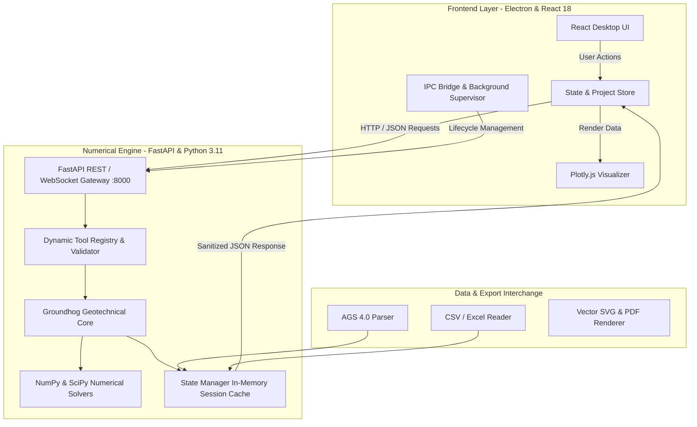

# System Architecture Overview

GeoCore is designed around a multi-tier hybrid architecture combining a high-performance **FastAPI / Python** numerical engine with a responsive **Electron / React** desktop user interface.

---

## 🏛️ High-Level System Architecture

---

## 🔍 Core Component Breakdown

### 1. Frontend Layer (`electron-app`)
- **React 18 + Vite + Tailwind CSS**: Clean, fast, component-driven UI with instant state reactivity.
- **Lucide Icons & Plotly.js**: High-density engineering plots with hover tooltips, box zoom, pan, and SVG export.
- **Electron Main Process (`electron/main.js`)**: Supervised child process launcher that boots the local Python backend binary and monitors its health.

### 2. Numerical Engine (`python-backend`)
- **`main.py`**: FastAPI application entry point with CORS policies and global exception handlers.
- **`core/registry.py`**: Dynamic reflection engine that automatically scans the Groundhog library and registers mathematical functions.
- **`core/wrappers.py`**: Type-safe argument mapping, numerical sanitization (NaN/Infinity to JSON-safe null), and Plotly figure serialization.
- **`core/state.py`**: Stateful memory session store for active `SoilProfile`, `CalculationGrid`, and `AGSConverter` objects.
