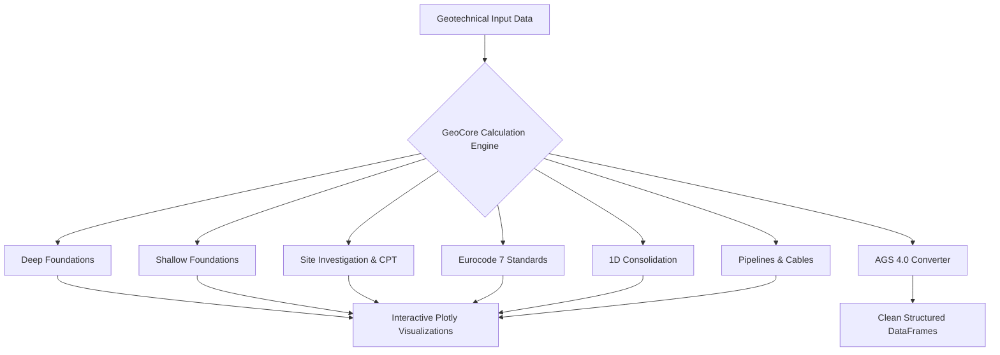

# GeoCore Documentation Portal

  v1.0.0 Stable
  Open Source (GPL v2)
  FastAPI + Electron + React

Welcome to the official technical documentation for **GeoCore** — the advanced open-source geotechnical desktop platform engineered for geotechnical engineers, offshore specialists, researchers, and civil contractors.

---

## 🌟 Key Capabilities at a Glance

### 1. Site Investigation & In-Situ Testing
- **PCPT / CPT Soundings**: Automated Robertson (1990/2009/2016) Soil Behavior Type (SBT) classification, $Q_{tn}-F_r$ and $I_c$ calculations, undrained shear strength ($s_u$) profiling, $G_{max}$ small-strain shear modulus.
- **SPT Processing**: Standardized $N_{60}$ and $(N_1)_{60}$ corrections with Liao & Whitman overburden factors.
- **Laboratory Soil Mechanics**: Casagrande A-Line plasticity chart classification, Particle Size Distribution (PSD) with $D_{10}, D_{30}, D_{60}, C_u, C_c$ metrics.

### 2. Deep & Shallow Foundations
- **Axial Pile Capacity**: LCPC (Bustamante & Gianeselli), Koppejan, De Beer, and AxCap automated penetration curves.
- **Shallow Footings**: Drained and undrained bearing capacity according to Eurocode 7 & Vesic, elastic/consolidation settlement (Schmertmann, Janbu, Christian & Carrier).
- **Effective Footing Area**: Full implementation of API RP 2GEO circular and rectangular eccentric load reductions.

### 3. Standards & Geotechnical Data Interoperability
- **Eurocode 7 (EN 1997-1)**: Automated partial factor selection for Design Approaches DA1 (Combination 1 & 2), DA2, and DA3 across STR and GEO limit states.
- **Characteristic Parameter Selection**: Schneider (1997) Bayesian confidence statistical assessments for constant values and linear depth trends.
- **AGS 4.0 File Converter**: Instant validation, group extraction (PROJ, HOLE, HDPH, SAMP, ISPT, GEOL, etc.), and export to CSV, Excel, or Pandas DataFrames.

---

## 🚀 Quick Navigation

| Topic | Description | Link |
| :--- | :--- | :--- |
| **Quickstart Guide** | Get up and running in under 5 minutes | [Get Started &rarr;](getting-started/quickstart.md) |
| **Deep Foundations** | LCPC, Koppejan, De Beer, and AxCap pile capacity | [Deep Foundations &rarr;](modules/deep-foundations.md) |
| **Shallow Foundations** | Bearing capacity, stress distribution & settlement | [Shallow Foundations &rarr;](modules/shallow-foundations.md) |
| **Site Investigation** | CPT Robertson classification, SPT & Lab charts | [In-Situ Testing &rarr;](modules/site-investigation.md) |
| **Eurocode 7** | DA1/DA2/DA3 partial factors & Schneider parameters | [Eurocode 7 &rarr;](modules/eurocode7.md) |
| **Consolidation** | 1D Terzaghi dissipation and isochrone plots | [Consolidation &rarr;](modules/consolidation.md) |
| **Architecture** | System architecture, FastAPI backend & Electron IPC | [Architecture &rarr;](developer/architecture.md) |

---

<a href="../" class="back-to-home">
  <svg width="16" height="16" viewBox="0 0 24 24" fill="none" stroke="currentColor" stroke-width="2"><path d="m3 9 9-7 9 7v11a2 2 0 0 1-2 2H5a2 2 0 0 1-2-2z"/></svg>
  Back to Marketing Home
</a>