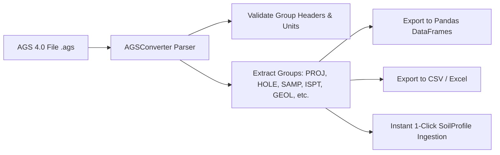

# AGS 4.0 Geotechnical File Converter

GeoCore includes an automated, full-spec parser and converter for **AGS 4.0 (Association of Geotechnical and Geoenvironmental Specialists)** data files.

---

## 📄 What is the AGS Format?

The AGS format is the global standard data interchange format for geotechnical and geoenvironmental ground investigation data across the UK, Australia, Middle East, and worldwide.

---

## ⚡ Key Capabilities in GeoCore



### Supported AGS Groups

1. **`PROJ`**: Project metadata, client name, contractor, site coordinates.
2. **`HOLE`**: Borehole, CPT sounding, and trial pit locations ($X, Y, Z$, groundwater level, final depth).
3. **`GEOL`**: Geological stratigraphy and strata description logs.
4. **`SAMP`**: Soil sample records, depth intervals, sample types.
5. **`ISPT`**: In-situ Standard Penetration Test blow counts ($N$-values, penetration increments).
6. **`DCPT` / `SCPG`**: Dynamic cone and piezocone test data.
7. **`LLPL` / `GRAT`**: Atterberg limits and particle size distribution lab records.

---

## 💻 API & Python Integration

```python
from core.wrappers import AGSConverter

# Initialize converter
converter = AGSConverter("borehole_investigation.ags", encoding="utf8", agsformat="4")
converter.extract_groupnames()

# Extract specific group as sanitized Pandas DataFrame
ispt_df = converter.convert_ags_group("ISPT", verbose_keys=False)
print(ispt_df.head())
```
