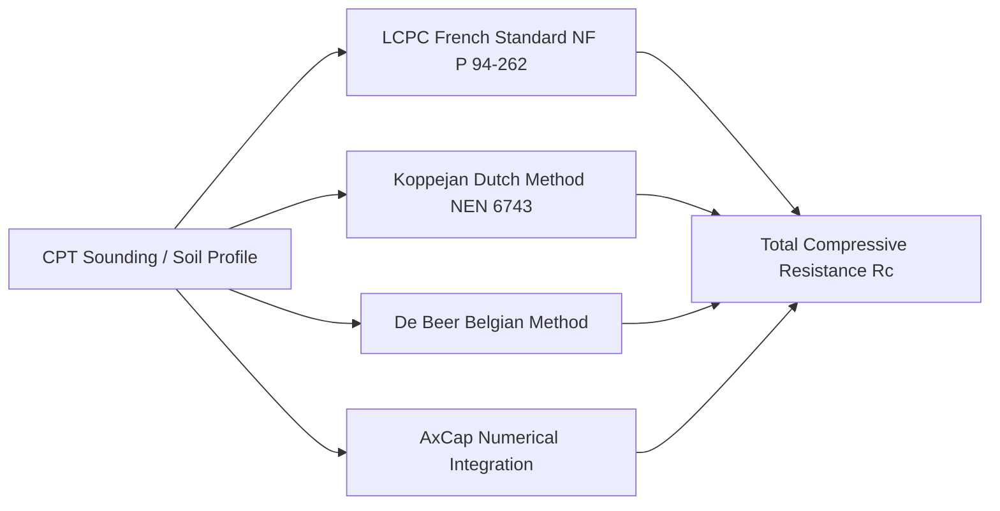

# Deep Foundations & Axial Pile Capacity

GeoCore provides industry-standard, analytical, and empirical algorithms for evaluating axial pile capacity, shaft resistance distributions, and base bearing capacity from in-situ CPT soundings and soil parameters.

---

## 📚 Supported Calculation Methods



---

## 1. LCPC Method (Bustamante & Gianeselli / NF P 94-262)

The **LCPC (Laboratoire Central des Ponts et Chaussées)** method computes unit base resistance $q_b$ and unit shaft friction $q_s$ directly from CPT cone resistance ($q_c$).

### Base Bearing Capacity
$$R_b = A_b \cdot q_b = A_b \cdot k_b \cdot q_{ce}$$

Where:
- $A_b$ = Base cross-sectional area ($\pi D^2 / 4$).
- $k_b$ = Base bearing factor depending on soil nature and pile installation method (typically $0.40$ to $0.60$ for driven piles, $0.15$ to $0.35$ for bored piles).
- $q_{ce}$ = Equivalent cone resistance averaged over an influence zone from $1.5D$ below the pile tip to $1.5D$ above the tip, clipped to prevent local spikes:
  $$q_{ce} = \frac{1}{3D} \int_{L-1.5D}^{L+1.5D} q_c(z) \, dz$$

### Shaft Resistance
$$R_s = \sum_i P \cdot q_{si} \cdot \Delta z_i = \sum_i \pi D \cdot \frac{q_{ci}}{\beta} \cdot \Delta z_i$$
Subject to maximum unit friction limits $q_{s,max}$ based on the designated soil group (Group IA, IB, IIA, IIB, etc.).

---

## 2. Koppejan Method (Dutch Standard NEN 6743)

The **Koppejan method** evaluates pile base resistance by taking into account the variation of cone resistance above and below the pile base over three depth zones:

$$q_b = \frac{1}{2} \cdot \alpha_p \cdot \beta \cdot s \cdot \left[ \frac{q_{c;I;mean} + q_{c;II;mean}}{2} + q_{c;III;mean} \right]$$

Where:
- $q_{c;I;mean}$ = Mean cone resistance in Zone I (ranging from $0.7D$ to $4.0D$ below base).
- $q_{c;II;mean}$ = Minimum cone resistance in Zone II (from base down to selected critical depth).
- $q_{c;III;mean}$ = Mean cone resistance in Zone III (ranging from base up to $8.0D$ above base).
- $\alpha_p$ = Pile class factor for base resistance.
- $\beta$ = Pile base shape factor ($\beta = 1.0$ for circular or square piles).
- $s$ = Cross-sectional shape factor.

---

## 3. De Beer Method (Belgian Standard)

The **De Beer calculation** applies a progressive downward averaging procedure that models the scale effect of the large pile diameter compared to the small CPT cone penetrometer:

$$q_b = \alpha_b \cdot q_{c;effective}$$
$$R_s = \sum \chi_s \cdot \alpha_s \cdot q_c(z) \cdot \Delta z$$

---

## 4. AxCap Numerical Capacity Integrator

The **AxCap** module integrates arbitrary continuous unit friction $f_s(z)$ and unit end bearing $q_b(z)$ profiles along a fine vertical calculation grid ($dz = 0.1\text{ m}$ to $1.0\text{ m}$):

- Handles open-ended and closed-ended tubular piles (coring vs. plugged behavior).
- Subtracts buoyant pile self-weight and internal soil plug weight.
- Generates high-resolution depth vs. $R_b$, $R_s$, and total capacity $R_c$ plots.

### Typical AxCap Python Wrapper Request

```json
{
  "soilprofile": "sp_9874",
  "circumference": 3.14159,
  "base_area": 0.7854,
  "internal_circumference": 2.98,
  "annulus_area": 0.076,
  "dz": 0.25,
  "pile_weight_permeter": 4.5
}
```
