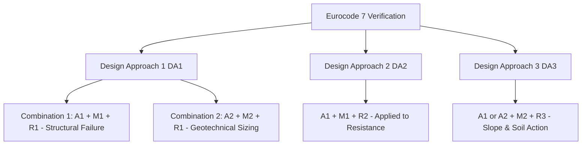

# Eurocode 7 & Geotechnical Standards

GeoCore implements comprehensive standards compliance with **EN 1997-1 (Eurocode 7: Geotechnical Design)**, including Design Approaches (DA1, DA2, DA3), partial factor matrices, and characteristic parameter selection according to Schneider (1997).

---

## 1. Design Approaches & Partial Factors (`Eurocode7_factoring_STR_GEO`)

Eurocode 7 mandates the verification of limit states (GEO and STR) using partial safety factors applied to actions, material properties, and resistances.

### Standard Partial Factors Summary

| Partial Factor Set | Permanent Unfavourable $\gamma_G$ | Variable Unfavourable $\gamma_Q$ | $\tan \phi'$ ($\gamma_\phi$) | Effective Cohesion $c'$ ($\gamma_c$) | Undrained Strength $s_u$ ($\gamma_{cu}$) | Weight Density $\gamma$ ($\gamma_\gamma$) |
| :---: | :---: | :---: | :---: | :---: | :---: | :---: |
| **A1** (Actions) | $1.35$ | $1.50$ | — | — | — | — |
| **A2** (Actions) | $1.00$ | $1.30$ | — | — | — | — |
| **M1** (Materials) | — | — | $1.00$ | $1.00$ | $1.00$ | $1.00$ |
| **M2** (Materials) | — | — | $1.25$ | $1.25$ | $1.40$ | $1.00$ |

---

## 2. Characteristic Parameter Selection (Schneider 1997)

According to Eurocode 7 §2.4.5.2, characteristic value $X_k$ is a cautious estimate of the value affecting the occurrence of the limit state:

### 1. Constant Value Analysis (`parameter_selection_constant_value`)
When property $X$ is assumed homogeneous across a stratum:
- If Coefficient of Variation ($V_x = \text{CoV}$) is known:
  $$X_k = X_{mean} \cdot \left( 1 - k_n \cdot V_x \right)$$
  *(where $k_n = 0.5$ for large soil volume averaging, or $1.645$ for local failure mechanisms)*
- If standard deviation $s$ is estimated from $N$ sample tests:
  $$X_k = X_{mean} \mp t_{N-1}^{\alpha} \cdot \frac{s}{\sqrt{N}}$$

### 2. Linear Depth Trend Analysis (`parameter_selection_linear_trend`)
When geotechnical strength increases linearly with depth ($X(z) = a + b \cdot z$):
- Computes Student-$t$ 95% upper and lower characteristic confidence bands around the linear regression trend line across requested evaluation depths.
