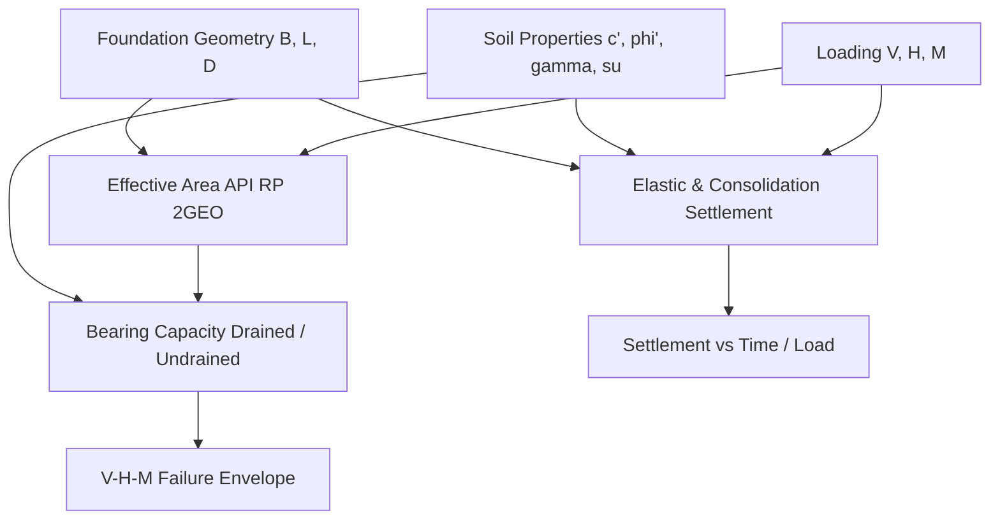

# Shallow Foundations & Settlement Analysis

GeoCore incorporates rigorous closed-form solutions and modern standard formulations for shallow footing bearing capacity, effective eccentric area reduction, elastic stress distribution, and long-term consolidation settlement.

---

## 🏗️ Core Calculation Capabilities

---

## 1. Drained & Undrained Bearing Capacity

### General Bearing Capacity Equation (Vesic / Eurocode 7 Annex D)

$$q_{ult} = c' N_c s_c d_c i_c b_c g_c + q' N_q s_q d_q i_q b_q g_q + \frac{1}{2} \gamma B' N_\gamma s_\gamma d_\gamma i_\gamma b_\gamma g_\gamma$$

Where the dimensionless bearing capacity factors are:
- $N_q = e^{\pi \tan \phi'} \tan^2\left(45^\circ + \frac{\phi'}{2}\right)$
- $N_c = (N_q - 1) \cot \phi'$
- $N_\gamma = 2(N_q - 1) \tan \phi'$ (or Hansen / Meyerhof / Vesic formulations configurable in GeoCore)

### Undrained Bearing Capacity (Tresca Criterion)
$$q_{ult} = (\pi + 2) \cdot s_u \cdot s_c \cdot d_c \cdot i_c + q_0$$
For a surface strip footing: $q_{ult} = 5.14 s_u + q_0$.

---

## 2. Effective Footing Area (Eccentricity Reduction)

Under eccentric vertical loads ($e_B = M_L / V$, $e_L = M_B / V$), GeoCore computes the Meyerhof equivalent reduced area or full API RP 2GEO geometry:

### Rectangular Footings
$$B' = B - 2e_B$$
$$L' = L - 2e_L$$
$$A' = B' \cdot L'$$

### Circular Footings (API RP 2GEO Formulation)
For a circular footing of radius $R$ and total eccentricity $e = \sqrt{e_x^2 + e_y^2}$:
$$A' = 2 \left[ R^2 \arccos\left(\frac{e}{R}\right) - e \sqrt{R^2 - e^2} \right]$$
$$B' = 2 \left( R - e \right)$$
$$L' = B' \sqrt{\frac{A' / B'}{1 - \frac{A' / B'}{2R}}}$$

---

## 3. Elastic & CPT-Based Settlement

### Schmertmann (1978) Strain Influence Method
Computes settlement in granular soils directly from CPT cone resistance $q_c$:

$$S = C_1 \cdot C_2 \cdot \Delta p \cdot \sum_{i=1}^{n} \frac{I_{z,i} \cdot \Delta z_i}{E_{s,i}}$$

Where:
- $C_1 = 1 - 0.5 \left(\frac{\sigma'_{v0}}{\Delta p}\right) \ge 0.5$ (Embedment depth correction factor).
- $C_2 = 1 + 0.2 \log_{10}\left(\frac{t}{0.1}\right)$ (Creep time factor).
- $E_{s,i} = 2.5 q_{c,i}$ (for square/circular footings) or $3.5 q_{c,i}$ (for strip footings).
- Peak strain influence factor: $I_{zp} = 0.5 + 0.1 \sqrt{\frac{\Delta p}{\sigma'_{vp}}}$.

---

## 4. Stress Distributions in Soil

GeoCore provides spatial 3D integration for vertical stress increase $\Delta \sigma_z(x,y,z)$:
- **Boussinesq Point Load**: $\Delta \sigma_z = \frac{3P}{2\pi} \frac{z^3}{(r^2 + z^2)^{5/2}}$
- **Westergaard Layered Soil**: Models horizontal reinforcement or stratified clay/sand deposits.
- **Rectangular & Circular Uniform Area Loads**: Analytical Newmark corner integrals.
