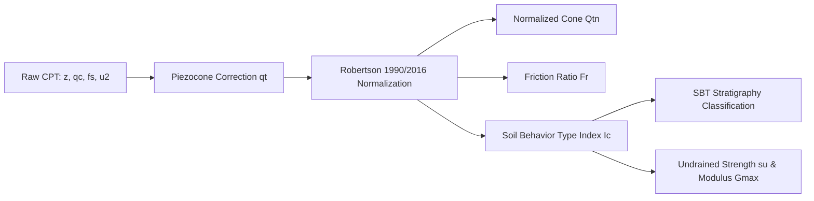

# Site Investigation & In-Situ Testing

GeoCore provides automated pipelines for processing Cone Penetration Tests (CPT/PCPT), Standard Penetration Tests (SPT), and standard laboratory classification tests.

---

## 1. PCPT Processing Class (`PCPTProcessing`)

The `PCPTProcessing` class takes raw sounding channels ($z, q_c, f_s, u_2$) and derives corrected geotechnical parameters across continuous depth intervals.

### Key Equations & Corrections

1. **Total Cone Resistance ($q_t$)**:
   $$q_t = q_c + u_2 \cdot (1 - a)$$
   *(where $a$ is the net cone area ratio, typically $0.70$ to $0.85$)*

2. **Normalized Cone Resistance ($Q_{tn}$)**:
   $$Q_{tn} = \left( \frac{q_t - \sigma_{v0}}{p_a} \right) \cdot \left( \frac{p_a}{\sigma'_{v0}} \right)^n$$
   *(where $n$ is the stress exponent dynamically iterated between $0.5$ and $1.0$ based on soil type)*

3. **Normalized Friction Ratio ($F_r$)**:
   $$F_r = \frac{f_s}{q_t - \sigma_{v0}} \times 100\%$$

4. **Soil Behavior Type Index ($I_c$)**:
   $$I_c = \left[ (3.47 - \log_{10} Q_{tn})^2 + (\log_{10} F_r + 1.22)^2 \right]^{0.5}$$

5. **Undrained Shear Strength ($s_u$)**:
   $$s_u = \frac{q_t - \sigma_{v0}}{N_{kt}}$$

---

## 2. Robertson Soil Behavior Type (SBT) Classification Zones

| Zone | SBT Classification Description | Typical $I_c$ Range |
| :---: | :--- | :--- |
| **1** | Sensitive Fine-Grained | $N/A$ (High $u_2$, low $F_r$) |
| **2** | Organic Soils - Peat | $I_c > 3.60$ |
| **3** | Clays: Silty Clay to Clay | $2.95 < I_c \le 3.60$ |
| **4** | Silt Mixtures: Clayey Silt to Silty Clay | $2.60 < I_c \le 2.95$ |
| **5** | Sand Mixtures: Silty Sand to Sandy Silt | $2.05 < I_c \le 2.60$ |
| **6** | Clean Sand to Silty Sand | $1.31 < I_c \le 2.05$ |
| **7** | Gravelly Sand to Dense Sand | $I_c \le 1.31$ |

---

## 3. Standard Penetration Test (`SPTProcessing`)

Corrects field blow count $N$ to energy- and overburden-standardized $(N_1)_{60}$:

$$(N_1)_{60} = N \cdot C_N \cdot C_E \cdot C_B \cdot C_R \cdot C_S$$

- **$C_N$**: Overburden correction factor according to Liao & Whitman (1986):
  $$C_N = \sqrt{\frac{100\text{ kPa}}{\sigma'_{v0}}} \le 1.7$$
- **$C_E$**: Energy ratio factor ($E_r / 60\%$).
- **$C_B$**: Borehole diameter factor ($1.00$ to $1.15$).
- **$C_R$**: Rod length factor ($0.75$ for $z < 4\text{m}$, up to $1.0$ for $z > 10\text{m}$).
- **$C_S$**: Sampler liner factor.

---

## 4. Laboratory Testing Charts

- **Plasticity Chart (`PlasticityChart`)**: Plots Liquid Limit ($LL$) vs. Plasticity Index ($PI$) against Casagrande's A-Line ($PI = 0.73(LL - 20)$) and U-Line ($PI = 0.9(LL - 8)$).
- **Particle Size Distribution (`PSDChart`)**: Semi-logarithmic grading curves automatically extracting effective diameter $D_{10}$, average diameter $D_{50}$, Coefficient of Uniformity ($C_u = D_{60}/D_{10}$), and Coefficient of Curvature ($C_c = D_{30}^2 / (D_{10} D_{60})$).
