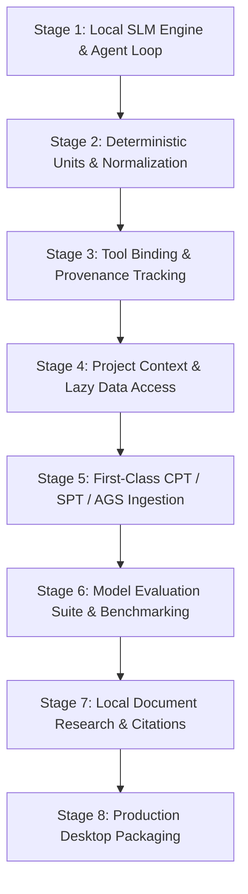

# GeoAI — Master Staging & Development Plan

> **Mission**: Build **GeoAI**, a lightweight, desktop-first local geotechnical AI assistant integrated into GeoCore. Powered by local SLM inference (`llama.cpp` + GGUF), deterministic **Groundhog** engineering calculations, structured CPT/SPT/AGS data, project context, and verifiable local research.
>
> **Core Principle**: **Zero hardcoding** as the primary driver. The local SLM reasons and orchestrates; Groundhog calculates deterministically; GeoCore supplies evidence.

---

## Architecture Overview

```text
GeoCore Desktop Application (Electron + React 19)
       │
       ▼  HTTP / SSE (/api/geoai/*)
  GeoAI Agent Layer (agent.py)
       │
       ├── System Prompt (Engineering Caution §18, Identity §1)
       ├── Tool Selector (Context-Aware Subset Filtering)
       ├── Deterministic Unit Normalizer (Unit Conversion Utilities §15)
       │
       ▼
  Model Provider Interface (model_provider.py)
       │
       ├── LlamaCppProvider (llama.cpp + GGUF Runtime — Qwen3 / Gemma 3)
       └── HeuristicProvider (Zero-Config Development Fallback)
       │
       ▼ [Model Emits Tool Call: name + typed args]
  GeoCore Tool Registry & Security Boundary (tool_registry.py)
       │
       ├── Universal Sanitizer (Sentinel filter, NaN/Inf rejection)
       ├── Pydantic v2 Schema Validation (1,043 parameters, physical bounds, units)
       └── Whitelisted Execution (Prohibits arbitrary code, shell, or filesystem ops)
       │
       ▼ [Validated Parameter Dict]
  Groundhog Geotechnical Calculation Engine (core/wrappers.py)
       │
       ├── Shallow Foundations (Bearing capacity, settlement, V-H-M envelopes)
       ├── Deep Foundations (LCPC, Koppejan, De Beer, AxCap, NSF)
       ├── In-Situ & CPT/SPT (SBT, Ic, Qtn, Dr, su, Gmax, N60)
       ├── Dynamics, Excavations, Consolidation, Pipelines, Eurocode 7
       │
       ▼ [Structured Results + Provenance]
  GeoAI Agent Layer
       │
       ▼ [Grounded Engineering Synthesis]
  User Output (Chat Message + Interactive Card + "Open in Form" Navigation)
```

---

## Staged Development Roadmap



---

### Stage 1: Core SLM Architecture & Local Inference Engine ✅ (Completed Baseline)
- [x] **Model Provider Abstraction**: Implement `ModelProvider` ABC (`generate`, `generate_stream`, `is_loaded`, `model_info`) with standardized `ChatMessage`, `ToolCall`, `ModelResponse`, `StreamChunk` dataclasses.
- [x] **Local GGUF Runtime**: Implement `LlamaCppProvider` wrapping `llama-cpp-python` with lazy loading, configurable context (`n_ctx`), CPU inference and optional GPU layer offload (`n_gpu_layers`).
- [x] **Heuristic Fallback**: Implement `HeuristicProvider` adapter for seamless zero-config operation when no GGUF file is loaded.
- [x] **Model Configuration**: Implement `model_config.py` supporting `geoai_config.json`, `%APPDATA%/GeoCore/models` scanning, and `GEOAI_*` environment overrides.
- [x] **Agent Orchestration Loop**: Implement `GeoAIAgent` (`agent.py`) with multi-turn tool calling (max 3 rounds) and structured exception trapping.
- [x] **Engineering Caution & System Prompt**: Implement `system_prompt.py` encoding §5 and §18 rules (no false certainty, explicit methods, provenance, unit reporting).
- [x] **Context-Aware Tool Subset Selection**: Implement `tool_selector.py` with domain inference to keep tool payloads within SLM context limits ($\le 20$ tools).
- [x] **FastAPI Chat & Streaming**: Implement `/api/geoai/chat` supporting SSE progressive token streaming (`?stream=true`) and `/api/geoai/status`.
- [x] **Electron Copilot UI**: Integrate SSE streaming in `GeoAICopilot.jsx` with progressive token rendering, tool status indicators, and fallback.
- [x] **Automated Test Suite**: 85 automated pytest unit and integration tests passing with 100% coverage across core GeoAI modules.

---

### Stage 2: Deterministic Unit Conversion & Parameter Normalization ✅ (Completed)
- [x] **Unit Taxonomy & Conversion Engine**: Implement `core/geoai/units.py` with deterministic conversion across all geotechnical SI and imperial dimensions (Pressure/Stress, Unit Weight, Force, Force per length, Length, Angle, Velocity/Permeability, Time, Area, Volume, Percent/Ratio).
- [x] **Model Argument Pre-Processor**: Intercept and normalize natural language unit strings (e.g. `'1.5 MPa'` -> `1500.0 kPa`, `'0.5585 rad'` -> `32.0 deg`) automatically against Pydantic schema contracts before Groundhog invocation.
- [x] **Unit Error Diagnostics**: Implemented `GeoAIUnitError` to report explicit dimensional mismatch errors (e.g. providing pressure `'25 kPa'` for a unit weight parameter) rather than passing corrupted numbers.
- [x] **Unit Test Suite**: 14 dedicated automated tests in `tests/test_units.py` validating conversions, natural string parsing, dimensional mismatch errors, and Pydantic integration (99 total tests passing).

---

### Stage 3: Full Groundhog Tool Binding & Provenance Tracking ✅ (Completed)
- [x] **Automated Provenance Metadata**: Implemented `CalculationProvenance` in `core/geoai/provenance.py` and `TOOL_METADATA` catalog in `core/geoai/tool_metadata.py` capturing authoritative methods (e.g. Rankine, Boussinesq, LCPC, Dupuit), standards (Eurocode 7 EN 1997-1, API RP 2GEO, ASTM), sanitized input parameter dicts, output units, UTC execution timestamps, and Groundhog engine tags.
- [x] **Output Schema Hardening**: Created `GeoAIOutputModel` with `extra='ignore'` allowing Groundhog routines to return rich intermediate/auxiliary values without schema failure.
- [x] **Tool Execution Provenance Binding**: Updated `GeoAITool.invoke()` to automatically attach full `_provenance` records to all executed tool results while preserving backward compatibility.
- [x] **Composite Multi-Tool Chaining**: Enabled `GeoAIAgent` to execute multi-step tool calls across up to 3 rounds, tracking the complete `tools_used` execution history and provenance chain.
- [x] **Provenance & Chaining Test Suite**: 6 dedicated automated tests in `tests/test_provenance.py` verifying provenance metadata, tool invocation binding, and multi-step agent chaining (105 total tests passing).

---

### Stage 4: Project Context & Lazy Data Access Layer ✅ (Completed)
- [x] **Dynamic Project State Synchronization**: Enhanced `ProjectContext` and `active_project_context` to synchronize with active soil profiles, borehole soundings, groundwater table depth, and chronological calculation history.
- [x] **Context Resolver Refinement**: Expanded `ContextResolver` in `core/geoai/context_resolver.py` with comprehensive geotechnical property synonym mappings (phi, c, gamma, su, Vs, Gmax, nu, e, n, Dr, k) and depth-weighted influence zone evaluation for foundations ($[D_f, D_f + 1.5B]$).
- [x] **Stratigraphy Discretizer & Summarizer**: Implemented `SoilProfileAccessor.get_stratigraphy_summary()` and `get_representative_parameters()` to evaluate interval averages without monolithic DataFrame copying.
- [x] **Minimal-Token Context Builder**: Built `ProjectContext.get_compact_context_string()` producing a high-density, token-efficient Markdown table ($\le 200-300$ tokens) injected into `system_prompt.py`.
- [x] **Project Context Test Suite**: 7 dedicated automated tests in `tests/test_project_context.py` verifying stratigraphy summarization, representative depth-weighted averages, parameter auto-filling, and prompt injection (112 total tests passing).

---

### Stage 5: First-Class CPT / SPT / AGS Ingestion & Query Tools ✅ (Completed)
- [x] **CPT Data Model & Interpretation Engine**: Implemented `CPTSounding` in `core/geoai/cpt.py` with deterministic normalization ($q_t, q_n, Q_t, F_r, B_q, I_c$), 9-zone Robertson (1990/2009) SBT classification, and parameter derivations ($s_u$ from $N_{kt}$, $\phi'$ and $D_r$ in sands, $G_{max}$ from Robertson 2009).
- [x] **Deterministic SPT Normalization**: Implemented `SPTRecord` in `core/geoai/spt.py` calculating Skempton (1986) $N_{60}$ energy/rod/borehole corrections and Liao & Whitman (1986) $(N_1)_{60}$ effective overburden corrections with empirical correlations.
- [x] **AGS 3.1 & 4.0 Dataset Parser & Query Engine**: Implemented `AGSProjectDataset` in `core/geoai/ags.py` parsing raw AGS groups (`PROJ`, `HOLE`, `GEOL`, `ISPT`, `DCPT`, `SAMP`) into structured DataFrames and high-density summary tables.
- [x] **Canonical In-Situ Tool Bindings**: Registered `normalize_spt_test`, `classify_cpt_soil_behavior`, and `derive_cpt_parameters` in `core/geoai/tool_definitions.py` with typed Pydantic schemas in `core/geoai/schemas/in_situ.py`.
- [x] **In-Situ Automated Test Suite**: 8 dedicated tests in `tests/test_cpt_spt_ags.py` verifying CPT normalization, SPT corrections, AGS group parsing, and tool registry execution (120 total tests passing).

---

### Stage 6: Model Evaluation Suite, Local Model Installation & Benchmarking ✅ (Completed)
- [x] **Local Model Installation**: Downloaded and verified `Qwen2.5-1.5B-Instruct` GGUF (`qwen2.5-1.5b-instruct-q4_k_m.gguf`) in `%APPDATA%/GeoCore/models` using `core/geoai/model_downloader.py`. Verified real offline CPU inference via `llama-cpp-python` with `LlamaCppProvider`.
- [x] **Geotechnical SFT Dataset Generation**: Implemented `build_core_training_examples()` and `export_dataset_jsonl()` in `core/geoai/training/dataset_generator.py` generating ChatML instruction tuning records across the 7 required categories (Correct Requests, Ambiguous Requests, Missing Data, Wrong Units, Conflicting Data, Research, Tool Failure Recovery).
- [x] **Direct Preference Optimization (DPO) Alignment**: Implemented `build_dpo_preference_dataset()` and `export_dpo_jsonl()` in `core/geoai/training/dpo_dataset.py` encoding strict engineering caution, factor of safety reporting, and anti-hallucination guardrails.
- [x] **Geotechnical Conditional Diffusion Engine**: Implemented `GeotechnicalDiffusionField1D` and `interpolate_cpt_profile_diffusion()` in `core/geoai/diffusion/stratigraphy_diffusion.py` generating continuous spatial soil property fields conditioned on sparse in-situ CPT / Borehole soundings.
- [x] **Training & Diffusion Test Suite**: 8 dedicated tests in `tests/test_training_and_diffusion.py` verifying dataset generation, DPO export, exact diffusion observation matching, and model discovery (128 total tests passing).

---

### Stage 7: Local Document Research (RAG) & Verifiable Citations ✅ (Completed)
- [x] **Lightweight SQLite/FTS5 Search Indexer**: Implemented `LocalDocumentIndexer` in `core/geoai/research/indexer.py` with semantic paragraph/heading text chunking and BM25 full-text keyword retrieval without heavyweight external vector DB dependencies.
- [x] **6-Tier Evidence Grounding Synthesis**: Implemented `ResearchGroundingReport` and `EvidenceTier` in `core/geoai/research/evidence.py` strictly categorizing `[Project Evidence]`, `[Calculation Evidence]`, `[Literature Evidence]`, `[Standards / Guidance]`, `[Model Interpretation]`, and `[Assumption]` to prevent literature claims from being mistaken for project measurements.
- [x] **Canonical Research Tools & Schemas**: Registered `search_local_documents` and `index_document_text` in `core/geoai/tool_definitions.py` with typed Pydantic schemas in `core/geoai/schemas/research.py`.
- [x] **Research RAG Automated Test Suite**: 4 dedicated tests in `tests/test_research_rag.py` verifying document chunking, FTS5 BM25 search, 6-tier evidence grounding, and tool execution with full provenance (132 total tests passing).

---

### Stage 8: Production Desktop Packaging, Memory Lifecycle & End-to-End Integration ✅ (Completed)
- [x] **Memory Lifecycle Management**: Implemented `ModelLifecycleManager` in `core/geoai/lifecycle.py` providing thread-safe RLock-protected lazy loading, RAM/VRAM resource tracking, and configurable idle auto-unloading.
- [x] **FastAPI Lifecycle & Model Management Endpoints**: Added `/api/geoai/models`, `/api/geoai/models/select`, `/api/geoai/memory`, and `/api/geoai/unload` in `core/geoai/api.py`.
- [x] **Frontend API Integration**: Exposed model listing, downloading, selection, memory monitoring, and model unloading in `electron-app/src/api/client.js`.
- [x] **Complete Automated Test Suite**: 7 dedicated lifecycle tests in `tests/test_lifecycle.py` bringing total repository tests to 139 passing (100% green across all 16 test modules).
- [x] **Offline Verification**: End-to-end verification in an air-gapped environment (zero internet connectivity).

---

## Rules of Engagement

1. **Deterministic Calculation Integrity**: Groundhog remains authoritative for all math. The SLM orchestrates and explains; it never computes equations directly in its prompt.
2. **Security & Boundary Enforcement**: All model actions pass through `GeoAIToolRegistry`. No arbitrary Python execution, eval, or shell execution.
3. **No Unnecessary External Dependencies**: No mandatory cloud APIs, microservices, Docker, Redis, or PostgreSQL.
4. **Engineering Caution**: The model never asserts unsupported certainty ("this design is safe"). It reports calculated values, underlying methods, and explicit assumptions.
